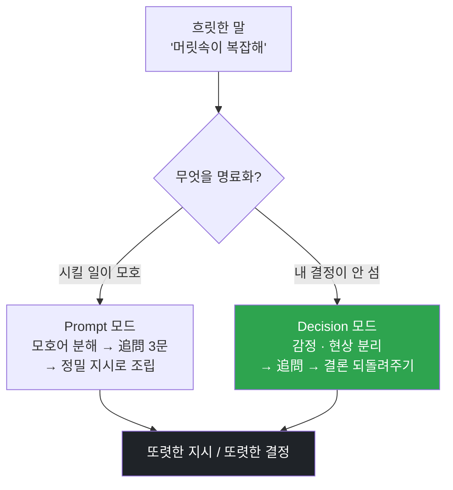

<p align="center">
  <a href="../../README.md">← 전체 스킬 모음으로</a>
</p>

<h1 align="center">aiden-clarify</h1>

<p align="center">
  <strong>흐릿한 생각·요청·결정을 판단 가능한 형태로 만드는 명료화 스킬</strong><br>
  머릿속에 떠다니는 경계 없는 생각 덩어리를 말로 끄집어내 정리합니다.
</p>

<p align="center">
  
  
</p>

---

## 한 줄로

> **만드는 건 쉬워졌습니다. 문제는 무엇을 만드느냐, 그리고 무엇을 원하느냐입니다.**

무엇을 시켜야 할지 말이 안 떨어질 때, 혹은 마음속 결정이 안 설 때, 마주 앉아 **하나씩 물어서** 흐릿한 것을 또렷하게 만듭니다.

---

## 두 모드로 돌아갑니다

첫 갈림은 "무엇을 명료화하나"입니다.

| 모드 | 언제 | 무엇을 |
|---|---|---|
| **Prompt 모드** | 인공지능에게 시킬 일이 모호할 때 | 모호한 요청 → **정밀한 지시**로 조립 |
| **Decision 모드** | 내 안의 곤란·결정이 안 풀릴 때 | **감정과 현상을 갈라** 결정을 또렷하게 |

두 모드의 리듬이 반대입니다 — **Prompt = 효율**(합쳐 묻고 2~3턴 안에 실행), **Decision = 깊이**(한 번에 한 질문, 대신 결정해 주지는 않습니다).

### Decision 모드의 심장 — 감정과 현상을 가른다

내가 어떻게 느꼈나(감정)와 실제로 무슨 일이 있었나(현상)를 섞어 두면 판단이 흐려집니다. 이 둘을 두 칸으로 갈라 적는 것이 이 모드의 핵심입니다. 조언하거나 평가하지 않고, **당신이 한 말로** 결론을 되돌려 줍니다.

---

## 어떻게 명료해지나 — 3층

| 층 | 방법 | 하는 일 |
|---|---|---|
| 겉·스캔 | 복합 → 원자 분해 | 모호어("최적화·잘·다듬어")를 찾아 쪼갭니다 |
| 중간·발굴 | 追問(추문) | 이미 있으나 말로 안 나온 의도를 끄집어냅니다 |
| 안쪽·감응 | 암묵지 추출 | 물어서도 안 나오는 감각을 示範·反面으로 뽑습니다 |

안쪽 층은 마지막 안전망입니다. "그 느낌 알잖아…" 하고 막힐 때만 켜고, 대개는 쓰지 않습니다.



---

## 지키는 원칙

1. **이미 명확하면 붙잡지 않습니다.** "충분히 명확합니다, 바로 갑니다" 하고 진행합니다.
2. **말하지 않은 것을 채우지 않습니다.** 필요하면 지어내지 말고 물어봅니다.
3. **Decision 모드에서는 대신 정하지 않습니다.** 평가("그건 정상이에요")도 하지 않습니다.
4. **당신 원문을 씁니다.** 요약해서 바꿔 놓지 않습니다.

### 새벽 4시 메모 모드
"방금 깼는데 생각이 많아" 같은 상태면, 정리하려 들지 않고 셋만 받습니다 — 무슨 생각이 드나 · 어떤 느낌이 제일 센가 · 하나만 남긴다면 무슨 질문인가.

---

## 설치

**Mac / Linux** <sub>(Apple Silicon·Intel 공통 — 파일 복사라 칩과 무관)</sub>
```bash
mkdir -p ~/.claude/skills
git clone https://github.com/imbrass9/aiden.git
cp -r aiden/skills/aiden-clarify ~/.claude/skills/
```

**Windows (PowerShell)**
```powershell
New-Item -ItemType Directory -Force "$env:USERPROFILE\.claude\skills" | Out-Null
git clone https://github.com/imbrass9/aiden.git
Copy-Item -Recurse aiden\skills\aiden-clarify "$env:USERPROFILE\.claude\skills\"
```

설치 후 클로드 코드를 다시 시작하면 스킬이 로드됩니다.

---

## 이렇게 부르면 됩니다

```
생각 정리 좀 해줘
머릿속이 복잡해
이거 어떻게 말해야 할지 모르겠어
결정을 못 하겠어
감정이랑 사실을 못 가르겠어
```

여기서 방향이 서면 코어를 세우는 [`aiden-core`](../aiden-core/README.md)로 넘어갑니다.
