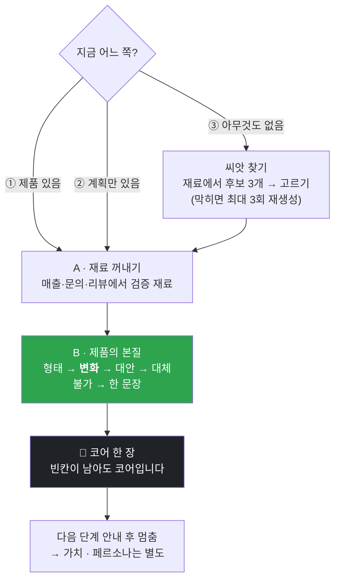

<p align="center">
  <a href="../../README.md">← 전체 스킬 모음으로</a>
</p>

<h1 align="center">aiden-core</h1>

<p align="center">
  <strong>비즈니스의 코어(재료 + 제품의 본질)를 인터뷰로 함께 세우는 스킬</strong><br>
  주요 가치와 주요 페르소나를 정하기 <b>전 단계</b>를 담당합니다.
</p>

<p align="center">
  
  
</p>

---

## 한 줄로

> **만드는 건 이제 어렵지 않습니다. 문제는 무엇을 만드느냐입니다.**

무엇을 팔지, 어떤 사업을 할지 아직 흐릿한 사람과 마주 앉아, **말로 끄집어내서** 사업의 뿌리 두 개를 세워 줍니다. 혼자 백지 앞에서 멈춰 있던 사람이 이 스킬을 지나면 "내가 파는 게 무엇을 바꾸는가"를 한 문장으로 들고 나옵니다.

---

## 무엇을 세우나

두 블록이 코어입니다.

| 블록 | 무엇을 |
|---|---|
| **A · 재료** | 내가 이미 가진 것 — 하는 일 · 남이 나에게 자꾸 묻는 것 · 반복해서 풀어 온 것 · 접근 가능한 것 |
| **B · 제품의 본질** | 형태 · **변화(Before→After)** · 대안 · 대체 불가 · **한 문장** |

여기까지가 코어입니다. **가치와 페르소나는 이 코어가 나온 뒤에 따로 세웁니다.** 이 스킬은 그 앞까지만 책임집니다.

### 이 스킬의 심장 — '변화' 칸

> **사람들은 드릴이 아니라, 벽의 구멍을 삽니다.**

고객이 사는 것은 상품이 아니라 **그 상품이 만드는 변화**입니다. 그래서 B의 '변화' 칸이 코어의 심장이고, 나머지 칸은 그 앞뒤를 받쳐 줍니다.

**한 문장**은 이 틀로 압축합니다.

```
"우리는 ___를 파는 게 아니라, ___를 판다."
    앞칸 = 형태(드릴)         뒷칸 = 변화(구멍)
```

---

## 세 유형 모두 대응합니다

같은 표를 채우되, **A에서 B로 가는 길이 다릅니다.**

| 유형 | 상태 | 하는 일 | A의 역할 |
|---|---|---|---|
| ① | 제품이 이미 있다 | 검증 · 재정렬 | 문의·리뷰·판매 기록에서 검증 재료를 꺼냅니다 |
| ② | 계획만 있다 | 구체화 | 경험에서 근거를 꺼냅니다 |
| ③ | **아무것도 없다** | **생성** | **재료에서 씨앗을 찾습니다** |

### ③번을 위한 장치 — 막다른 길을 만들지 않습니다

*"뭘 만들고 싶으세요?"* 를 백지에서 물으면 대부분 멈춥니다. 그래서 A를 다 들은 뒤 **사용자가 말한 재료에서만 씨앗 후보 3개를 뽑아 고르게** 합니다.

- "없다"고 하면 다른 각도로 다시 뽑습니다 (최대 3회).
- 그래도 안 잡히면 A로 돌아가 재료를 더 캡니다.
- 아이템이 안 나오는 것은 재료가 부족해서입니다.

> 제품이 없는 사람도 재료는 있습니다. 남이 나에게 자꾸 묻는 것, 내가 반복해서 풀어 온 것 — 거기에 씨앗이 있습니다.

---

## 어떻게 돌아가나



---

## 진행 원칙 (스킬이 지키는 규칙)

1. **한 번에 한 질문만.** 표를 통째로 던지면 사용자가 멈춥니다. 인터뷰처럼 하나씩 묻습니다.
2. **사용자가 말하지 않은 것을 채우지 않습니다.** 맥락이 필요하면 지어내지 말고 물어봅니다.
3. **'변화' 칸은 반드시 사용자 입에서.** 인공지능이 제안하더라도 확인 없이 확정하지 않습니다.
4. **"모르겠다"를 허용합니다.** 빈칸이 남은 코어도 코어입니다. 무엇이 비었는지 아는 것이 중요합니다.
5. **추상적인 답에는 한 번 더 묻습니다.** "좋은 서비스" → "누가 언제 쓰나요?"
6. **가치·페르소나로 넘어가지 않습니다.** 코어가 완성되면 다음 단계를 안내하고 멈춥니다.

---

## 이렇게 부르면 됩니다

```
코어 잡아줘
내 서비스 정리 좀 해줘
뭘 만들지 모르겠어
아직 뭘 파는지 모르겠는데 이거 될까
사업 아이템 찾고 싶은데 아무것도 없어
```

**"아직 아이템이 없어요"** 라고 말하는 순간이 이 스킬이 가장 필요한 때입니다.

---

## 설치

**Mac / Linux**
```bash
mkdir -p ~/.claude/skills
git clone https://github.com/imbrass9/aiden.git
cp -r aiden/skills/aiden-core ~/.claude/skills/
```

**Windows (PowerShell)**
```powershell
New-Item -ItemType Directory -Force "$env:USERPROFILE\.claude\skills" | Out-Null
git clone https://github.com/imbrass9/aiden.git
Copy-Item -Recurse aiden\skills\aiden-core "$env:USERPROFILE\.claude\skills\"
```

설치 후 클로드 코드를 다시 시작하면 스킬이 로드됩니다.

## 다음 단계

코어가 나오면 그 위에 두 가지를 세웁니다.

1. **주요 가치** — B의 '변화'를 고객의 말로 한 문장
2. **주요 페르소나** — 그 변화를 사는 사람 한 명

그다음 "이거 팔릴까"를 검증하는 단계는 [`reaction-lab`](../reaction-lab/README.md)이 이어받습니다.
