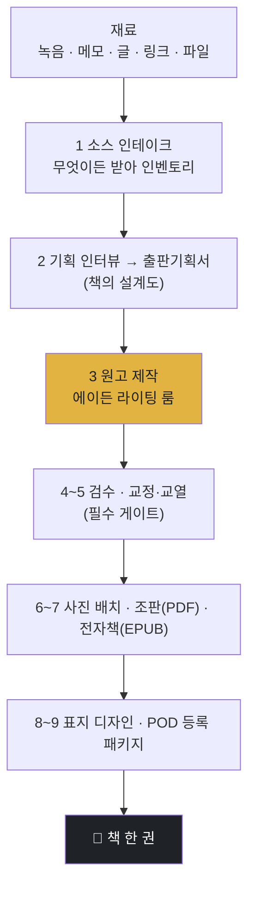

<p align="center">
  <a href="../../README.md">← 전체 스킬 모음으로</a>
</p>

<h1 align="center">book-factory <sub>(맛보기)</sub></h1>

<p align="center">
  <strong>어떤 재료든 넣으면 책 한 권이 나오는 출간 파이프라인</strong><br>
  녹음·메모·글·링크·파일을 넣으면 기획부터 원고·조판·인쇄용 PDF·전자책·표지·POD 등록까지 이어집니다.
</p>

<p align="center">
  
  
</p>

> 🟡 **이 페이지는 개요(맛보기)입니다.** 라이팅 룸·조판·템플릿 등 실제 제작 엔진 전체는 **에이든에게 컨설팅을 진행하면 제공**합니다.

---

## 한 줄로

> **재료를 넣으면 책이 나옵니다.**

사용자가 하는 일은 셋뿐입니다 — ① 재료 넣기 ② 선택하기 ③ 사진 넣기(선택). 나머지는 팩토리가 분석해 **선택지를 제시**하고, 고르면 책이 되도록 끝까지 끌고 갑니다. 백지 질문을 던지지 않습니다.

---

## 전체 파이프라인



---

## 무엇이 다른가

- **설계도 먼저.** 개발이 PRD 없이 시작하지 않듯, 출판기획서(장르·타깃·목차·문체)가 확정되기 전에는 원고를 쓰지 않습니다.
- **저자 목소리가 최우선.** 문체 샘플이 있으면 그 말투가 정답입니다. 어떤 제작 단계도 저자의 목소리를 덮어쓰지 못합니다.
- **날조 금지.** 실경험 장르는 소스에 있는 사실만 씁니다. 소스가 빈 장은 지어내지 않고, 저자에게서 실체를 뽑아 채웁니다.
- **집필은 라이팅 룸이 맡습니다.** 씬 라이터·아키텍트·리듬 마스터 등 역할별 편집팀이 초고부터 전권 판정까지 통과시킵니다. (엔진 상세는 컨설팅 시 제공)

---

## 이렇게 부르면 됩니다

```
책 만들어줘
이 녹음으로 책 내고 싶어
원고 조판해줘
전자책으로 만들어줘
POD 등록 준비
```

---

## 설치

**Mac / Linux** <sub>(Apple Silicon·Intel 공통 — 파일 복사라 칩과 무관)</sub>
```bash
mkdir -p ~/.claude/skills
git clone https://github.com/imbrass9/aiden.git
cp -r aiden/skills/book-factory ~/.claude/skills/
```

**Windows (PowerShell)**
```powershell
New-Item -ItemType Directory -Force "$env:USERPROFILE\.claude\skills" | Out-Null
git clone https://github.com/imbrass9/aiden.git
Copy-Item -Recurse aiden\skills\book-factory "$env:USERPROFILE\.claude\skills\"
```

설치 후 클로드 코드를 다시 시작하면 스킬이 로드됩니다.
