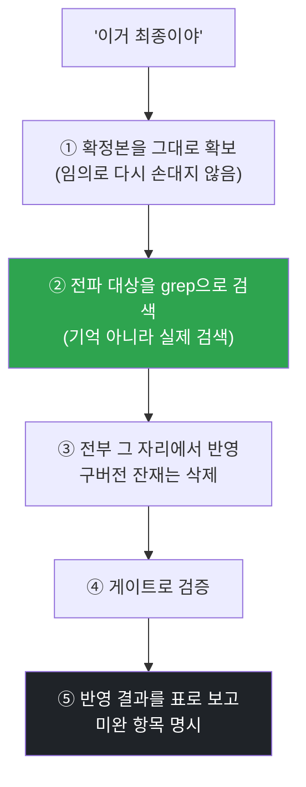

<p align="center">
  <a href="../../README.md">← 전체 스킬 모음으로</a>
</p>

<h1 align="center">finalize-propagate</h1>

<p align="center">
  <strong>"이걸로 확정"하면, 그 확정본을 관련 문서 전부에 그 자리에서 반영하는 스킬</strong><br>
  기억에 맡기지 않고 절차로 강제합니다.
</p>

<p align="center">
  
  
</p>

---

## 한 줄로

> **"수정하자 → 확정 → 근데 저장 안 됨"을 절차로 끊습니다.**

같은 사실이 여러 문서에 흩어져 있으면, 한 곳만 고치고 끝냈을 때 반드시 갈라집니다. 이 스킬은 확정하는 순간 **모든 관련 문서를 검색으로 찾아 한 세션 안에** 다 고칩니다.

---

## 절차 (건너뛰지 않습니다)



핵심은 ②입니다. 어디에 그 내용이 들어갔는지 **기억으로 떠올리지 않고**, `grep`으로 실제 파일을 찾습니다.

---

## 원칙

- **기억에 맡기지 않습니다.** 검색으로 찾고, 파일로 확인하고, 표로 보고합니다.
- **한 곳만 고치고 끝내면 미완입니다.** 같은 사실이 두 군데 있으면 반드시 갈라집니다.
- **구버전은 남기지 않습니다.** 정정 전 잔재는 지웁니다(버전 이력은 git이 가집니다).
- **보고 없이 "했습니다"로 끝내지 않습니다.** 무엇이 어디에 들어갔는지 눈에 보이게 냅니다.

---

## 이렇게 부르면 됩니다

```
이거 최종이야
이걸로 확정
최종으로 저장해
다 업데이트해줘
반영해줘
```
