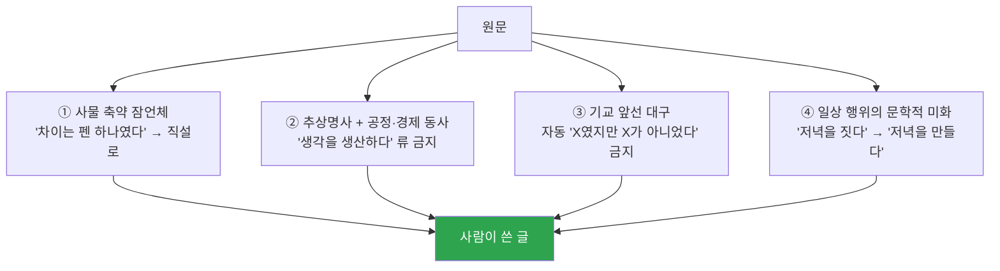

<p align="center">
  <a href="../../README.md">← 전체 스킬 모음으로</a>
</p>

<h1 align="center">humantouch-writing <sub>(맛보기)</sub></h1>

<p align="center">
  <strong>AI 티를 지우는 데서 그치지 않고, 사람이 쓴 최고 퀄리티의 글을 만드는 글쓰기 스킬</strong><br>
  저자가 누구든 그 저자의 목소리로, 목적별 톤에 맞춰 조절합니다.
</p>

<p align="center">
  
  
</p>

> 🟡 **이 페이지는 원리 소개(맛보기)입니다.** 라이팅 룸 생성·판정 엔진 전체는 부트캠프·컨설팅 코호트에서 제공합니다.

---

## 한 줄로

> **AI 관점의 부자연스러운 표현이 하나라도 있으면, 그 글은 퀄리티 높은 글이 아닙니다.**

AI 말투를 지우는 것은 스타일 옵션이 아니라 **합격선**입니다. 통과 기준은 둘 — ① 사람이 쓴 글로 읽히는가 ② 이 글의 저자 목소리인가.

---

## 먼저 레지스터 — 목적별 톤

모든 글을 같은 톤으로 사람답게 만들지 않습니다. **목적을 먼저 파악하고 톤을 고릅니다.**

| 레지스터 | 목표 톤 |
|---|---|
| **책·에세이** | 절제·문학적 규율, 장면 → 통찰, 단정으로 닫기 |
| **스레드·SNS** | 장면 있는 구어, 사람 냄새, 리듬 |
| **상세페이지·카피** | 구체·물성·판매, 짧고 검증 가능 |
| **이메일·비즈니스** | 단정·간결·정중, 결론 먼저 |

카피의 극대화된 친근 톤을 책·문서에 넣지 않습니다. 자리가 다릅니다.

---

## AI 말투 4계열 — 진짜 티는 여기서 납니다

고퀄 글에서 티는 유치한 단어가 아니라 **있어 보이려는 문장 기교**에서 납니다.



> 이 원칙은 산출물뿐 아니라 **대화·답변 자체에도** 적용됩니다.

---

## 관통 축 먼저 — 글의 한 문장 정의

글을 여러 갈래로 벌리기 전에, **이 글을 하나로 꿰뚫는 정의를 한 문장으로** 먼저 잡습니다. 축이 서면 나머지(소재·문단·예시)가 거기서 도출돼 글이 단순해집니다. 축은 대개 비유로 잡히지만, 그 비유는 이해를 잡는 사고 도구일 뿐 — 본문에 지어 넣는 문학적 비유와는 다릅니다.

---

## 이렇게 부르면 됩니다

```
사람이 쓴 것처럼 고쳐줘
AI 티 나는데 지워줘
챗지피티 같아
이 글 몇 프로 AI야?
humanize
```
