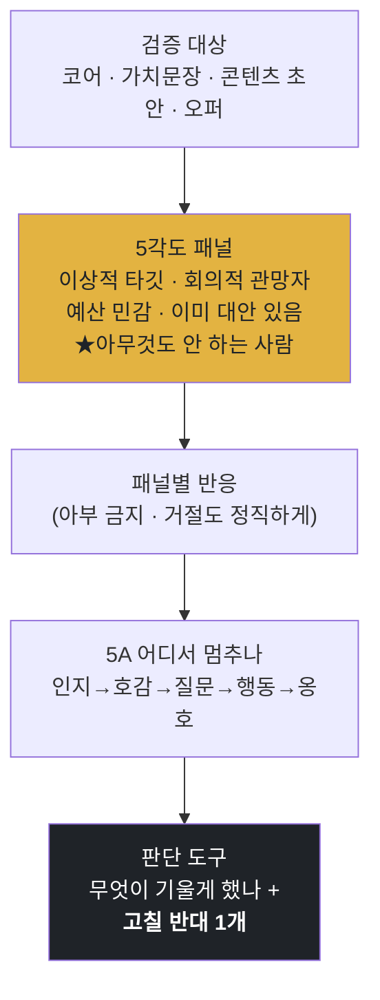

<p align="center">
  <a href="../../README.md">← 전체 스킬 모음으로</a>
</p>

<h1 align="center">reaction-lab</h1>

<p align="center">
  <strong>발행·제작 전에 가상 고객 패널을 세워 "이거 먹힐까"를 미리 검증하는 스킬</strong><br>
  코어·가치 문장·콘텐츠 초안·상품/오퍼 — 무엇이든 사람에게 부딪혀 봅니다.
</p>

<p align="center">
  
  
</p>

---

## 한 줄로

> **만드는 건 쉬워졌습니다. 문제는 그게 누구에게 먹히느냐입니다.**

[`aiden-core`](../aiden-core/README.md)가 코어를 세우는 스킬이라면, 이 스킬은 **그 코어가 실제 사람에게 먹히는지** 발행 전에 검증합니다. 통과한 것만 발행으로 넘깁니다.

```
aiden-core(코어) → 가치·페르소나 → reaction-lab(반응 검증) → 통과분만 발행
```

---

## 1원칙 — 아부하지 않습니다

인공지능에게 고객 반응을 흉내 내게 하면 십중팔구 가짜 긍정을 뱉습니다. 이 스킬은 **반대로** 갑니다 — 무관심·거절·"그냥 안 산다"를 정직하게 모델링합니다. "좋네요"로 끝나면 아무것도 검증하지 않은 것입니다. (약속 ≠ 증거)

---

## 다섯 시선 — MECE 패널

겹치지 않는 다섯 시선을 세웁니다. 한 명이라도 지어내면 검증이 무너집니다.

| # | 패널 | 이 사람이 대표하는 것 |
|---|---|---|
| 1 | **이상적 타깃** | 이게 정확히 필요한 사람 — 최상의 시나리오 |
| 2 | **회의적 관망자** | 관심은 있는데 안 믿는 사람 — 신뢰 장벽 |
| 3 | **예산 민감** | 가치는 아는데 가격에서 멈추는 사람 |
| 4 | **이미 대안 있음** | 지금 다른 방식으로 해결 중 — 전환 비용 |
| 5 | **★ 아무것도 안 하는 사람** | 문제를 못 느끼거나 미루는 사람 — **가장 큰 시장** |

★5번은 뺄 수 없습니다. 대부분의 경쟁 상대는 다른 회사가 아니라 "그냥 지금처럼 사는 것"이기 때문입니다.



---

## 지키는 원칙

- **페르소나는 재료에서 나옵니다.** 일반적인 "30대 직장인"을 지어내지 않고, 코어·기존 고객·시장에서 근거로 세웁니다. 근거가 없으면 `(가정)` 라벨을 붙입니다.
- **결과는 응원이 아니라 판단 도구입니다.** 무엇이 기울게 했고 무엇이 튕겼는지, **고칠 반대 1개**를 반드시 남깁니다.
- **입력은 무엇이든 받습니다.** 코어 한 장·가치 문장·콘텐츠 초안·상품/오퍼.

---

## 이렇게 부르면 됩니다

```
가상 고객한테 물어봐
이거 반응 어떨까
발행 전에 검증해줘
누가 이걸 살까
만든 오퍼가 팔릴까
```

---

## 설치

**Mac / Linux** <sub>(Apple Silicon·Intel 공통 — 파일 복사라 칩과 무관)</sub>
```bash
mkdir -p ~/.claude/skills
git clone https://github.com/imbrass9/aiden.git
cp -r aiden/skills/reaction-lab ~/.claude/skills/
```

**Windows (PowerShell)**
```powershell
New-Item -ItemType Directory -Force "$env:USERPROFILE\.claude\skills" | Out-Null
git clone https://github.com/imbrass9/aiden.git
Copy-Item -Recurse aiden\skills\reaction-lab "$env:USERPROFILE\.claude\skills\"
```

설치 후 클로드 코드를 다시 시작하면 스킬이 로드됩니다.
