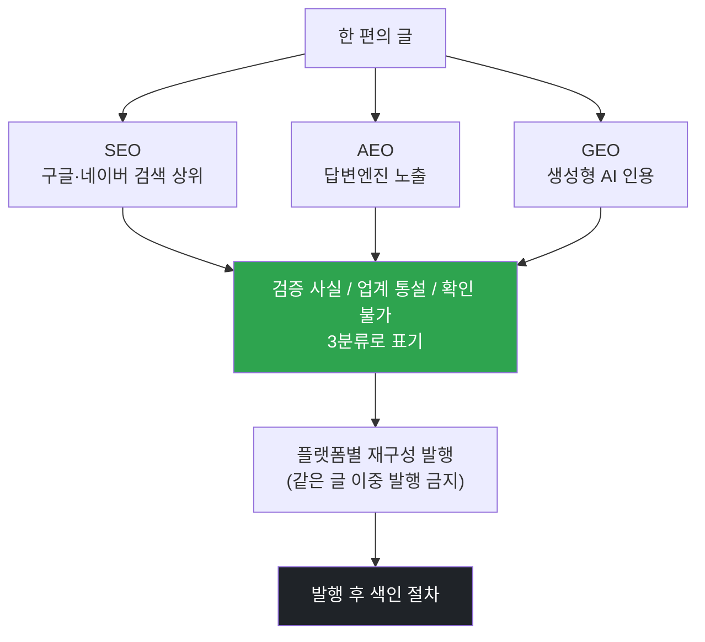

<p align="center">
  <a href="../../README.md">← 전체 스킬 모음으로</a>
</p>

<h1 align="center">search-optimizer</h1>

<p align="center">
  <strong>검색·AI가 내 글을 찾아 인용하게 만드는 구조 최적화 엔진</strong><br>
  SEO(구글·네이버)·AEO(답변엔진)·GEO(생성형 AI 인용)를 하나로 다룹니다.
</p>

<p align="center">
  
  
</p>

---

## 한 줄로

> **글의 질을 훼손하지 않고, 검색엔진과 생성형 AI가 이 글을 찾아 인용하게 만듭니다.**

이 스킬은 **구조·조판·배급·색인**만 담당합니다. 문장·톤은 [`humantouch-writing`](../humantouch-writing/README.md)이, 포지셔닝은 별도 가드가 맡습니다. 셋과 충돌하면 **이 스킬이 집니다** — 최적화가 글을 망치면 최적화가 아닙니다.

---

## 제1원칙

1. **검증된 사실과 업계 통설을 절대 섞지 않습니다.** "카더라"를 규칙으로 승격시키지 않습니다.
2. **수치 규칙(글자수·이미지 수·태그 개수)은 따르되 믿지 않습니다.** 그 수치를 맞추느라 글을 늘리지 않습니다.
3. **홍보성 톤은 인용을 깎습니다** (실측 −26% 상관). 세일즈하지 않는 것이 곧 최적화입니다.
4. **양산은 무효입니다** (페이지 수 ↔ AI 가시성 상관 0.194). 편수로 이기려 하지 않습니다.
5. **사실은 유통기한이 있습니다.** 재검증 기한을 지난 채로 쓰지 않습니다.

---

## 세 갈래를 한 번에



---

## 검증된 핵심 (요약)

- **네이버 `큐:`는 종료됐습니다.** 국내 AI 검색 노출의 대상은 이제 **AI 브리핑**이고, 그 인용의 약 70%가 네이버 자사 UGC(블로그·카페 등)입니다.
- **구글은 AI 답변용 특별 최적화가 따로 없습니다.** 기존 SEO가 그대로 유효하다는 게 공식 입장입니다.
- **GEO에서 효과가 확인된 것은 셋뿐** — 구체 통계·수치 / 신뢰 출처 인용 / 인라인 출처 표기. 키워드 스터핑은 효과가 없습니다.
- **유튜브 언급이 AI 가시성과 상관이 가장 높습니다.**

> 검증된 사실에는 출처와 재검증 기한이 붙어 있고, 업계 통설은 "규칙으로 승격 금지"로 따로 표시됩니다.

---

## 설치

**Mac / Linux**
```bash
mkdir -p ~/.claude/skills
git clone https://github.com/imbrass9/aiden.git
cp -r aiden/skills/search-optimizer ~/.claude/skills/
```

**Windows (PowerShell)**
```powershell
New-Item -ItemType Directory -Force "$env:USERPROFILE\.claude\skills" | Out-Null
git clone https://github.com/imbrass9/aiden.git
Copy-Item -Recurse aiden\skills\search-optimizer "$env:USERPROFILE\.claude\skills\"
```

설치 후 클로드 코드를 다시 시작하면 스킬이 로드됩니다.

---

## 이렇게 부르면 됩니다

```
이 글 검색 최적화해줘
네이버 블로그에 올릴 건데 상위노출되게
AI 검색에 인용되게 하려면
SEO 점검
색인 어떻게 넣지
```
