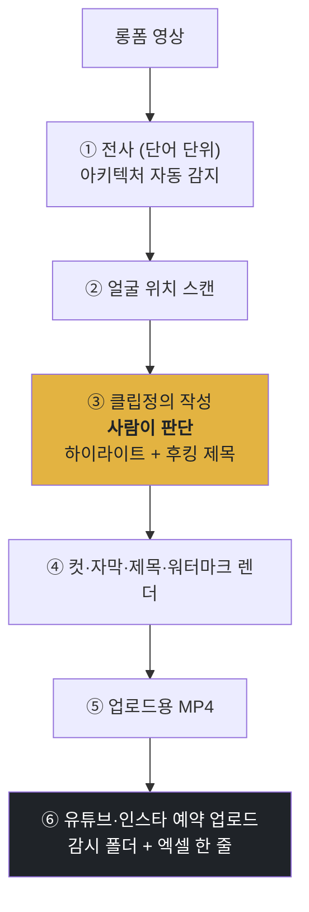

<p align="center">
  <a href="../../README.md">← 전체 스킬 모음으로</a>
</p>

<h1 align="center">shorts-factory</h1>

<p align="center">
  <strong>롱폼 영상 1개를 완성형 세로 쇼츠로 뽑고 예약 업로드까지 돌리는 로컬 파이프라인</strong><br>
  유료 도구(OpusClip·Make·n8n) 없이, 인텔·애플 실리콘 맥 모두에서 돕니다.
</p>

<p align="center">
  
  
  
</p>

---

## 한 줄로

> **롱폼 하나를 넣으면, 자르고 자막 박고 유튜브·인스타 예약 업로드까지 자동으로 갑니다.**

판단이 필요한 곳은 딱 한 군데(어느 구간을 자를지)뿐이고, 나머지는 전부 기계가 합니다. 그 한 곳에 시간을 씁니다.

---

## 파이프라인 전체



③만 판단이 필요하고 나머지는 기계입니다.

---

## 어느 맥에서든 돕니다

전사 1단계 앞에 **아키텍처를 감지해 알아서 갈리는 디스패처**를 뒀습니다. 같은 명령 하나로 두 종류의 맥 모두에서 돌고, 남에게 줘도 각자 컴에서 그대로 돕니다.

| CPU | 전사 경로 |
|---|---|
| **애플 실리콘** | mlx-whisper (GPU 가속) |
| **인텔 / 그 외** | faster-whisper (CPU) |

두 경로의 출력 포맷이 동일해서, 뒷단은 아키텍처와 무관하게 돕니다.

```bash
# 전사 — 이 한 줄이 CPU를 보고 알아서 갈립니다
python3 bridge/transcribe_any.py "롱폼.mp4" 롱폼_words.json

# 첫 실행 전 (자기 맥에 맞는 것 하나만)
brew install ffmpeg
pip install mlx-whisper      # 애플 실리콘
pip install faster-whisper   # 인텔
```

---

## 설치

**Mac / Linux** <sub>(설치는 칩 공통 · 실행 의존성은 Apple Silicon·Intel 다름 → 아래 「어느 맥에서든 돕니다」)</sub>
```bash
mkdir -p ~/.claude/skills
git clone https://github.com/imbrass9/aiden.git
cp -r aiden/skills/shorts-factory ~/.claude/skills/
```

**Windows (PowerShell)**
```powershell
New-Item -ItemType Directory -Force "$env:USERPROFILE\.claude\skills" | Out-Null
git clone https://github.com/imbrass9/aiden.git
Copy-Item -Recurse aiden\skills\shorts-factory "$env:USERPROFILE\.claude\skills\"
```

설치 후 클로드 코드를 다시 시작하면 스킬이 로드됩니다.

> ⚠️ **실행 환경**: 위 설치는 Mac·Windows 모두 됩니다. 다만 이 파이프라인의 **실제 실행은 macOS 전용**입니다 — 얼굴 스캔 단계가 macOS Vision을 쓰기 때문입니다. Windows에서는 파일은 설치되지만 파이프라인 실행에는 맥이 필요합니다. (전사·렌더용 `ffmpeg`은 Mac `brew install ffmpeg` / Windows `winget install ffmpeg`.)

---

## 이렇게 부르면 됩니다

```
이 영상 쇼츠로 잘라줘
롱폼 자르기
자막 박아줘
세로 영상 만들어
쇼츠 예약 업로드
```
