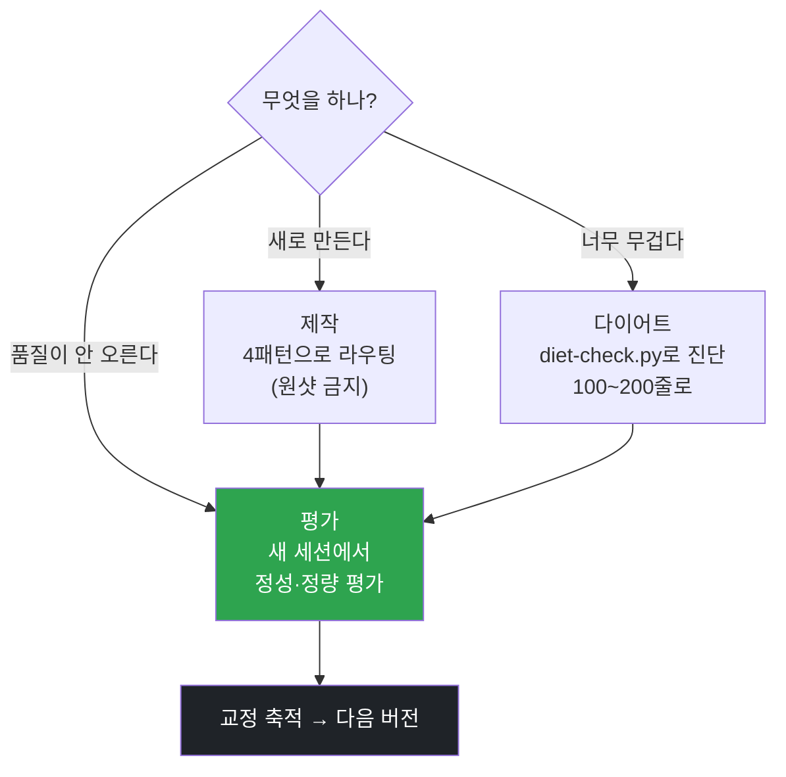

<p align="center">
  <a href="../../README.md">← 전체 스킬 모음으로</a>
</p>

<h1 align="center">skill-forge</h1>

<p align="center">
  <strong>스킬을 만들·다이어트·평가할 때 거는 메타 스킬</strong><br>
  "스킬을 손대는 작업"의 관문입니다. 스킬을 한 번에 끝내지 않고, 직원을 키우듯 육성합니다.
</p>

<p align="center">
  
  
</p>

---

## 한 줄로

> **스킬은 한 번에 완성되는 공짜 완성품이 아닙니다. 80점으로 시작해 쓰면서 90점대로 올립니다.**

"○○ 써주는 스킬 만들어줘" 한 줄로 시작하면 평균값 스킬이 나옵니다. 이 스킬은 그 함정을 절차로 막습니다. (출처: 샘 호트만 「SKILL 상위 1% 활용법」)

---

## 먼저 판정 — 지금이 3모드 중 무엇인가

| 신호 | 모드 | 하는 일 |
|---|---|---|
| "이거 스킬로 만들어" / 반복 작업 자동화 | **제작** | 모호성을 0으로 좁힌 뒤 설계 |
| "너무 길어 · 줄여줘 · 리팩터" | **다이어트** | 분류·실행·검증만 남기고 나머지는 참조로 |
| "품질이 안 올라 · 왜 이래" | **평가** | 새 세션에서 독립 평가 후 개선 |

모드가 섞이면 순서는 **제작 → 다이어트 → 평가**. 제작 직후에도 반드시 평가로 닫습니다.



---

## 각 모드의 핵심

**제작 — 한 줄 원샷 금지.** 인공지능이 "그 일을 하는 방식"을 모르는 게 근본 원인이라, 4패턴(플랜모드 인터뷰 / 고점-즉시-스킬화 / 바이럴-각색 / 스킬크리에이터 직행)으로 갈라 설계합니다.

**다이어트 — 기억이 아니라 스크립트로 진단.** 이상적 SKILL.md는 100~200줄, 그 안에 분류·실행·검증 세 가지만. 예시·데이터·판정표는 참조 폴더로 옮깁니다. **이동이지 삭제가 아닙니다.**

```bash
python3 diet-check.py <SKILL.md 경로>
```

**평가 — 같은 세션에서 평가하지 않습니다.** 인풋을 밀어넣은 세션은 편향됩니다. 새 세션에서, 실패를 "프로세스 이탈"과 "품질 부족"으로 갈라 진단합니다.

---

## 설치

**Mac / Linux**
```bash
mkdir -p ~/.claude/skills
git clone https://github.com/imbrass9/aiden.git
cp -r aiden/skills/skill-forge ~/.claude/skills/
```

**Windows (PowerShell)**
```powershell
New-Item -ItemType Directory -Force "$env:USERPROFILE\.claude\skills" | Out-Null
git clone https://github.com/imbrass9/aiden.git
Copy-Item -Recurse aiden\skills\skill-forge "$env:USERPROFILE\.claude\skills\"
```

설치 후 클로드 코드를 다시 시작하면 스킬이 로드됩니다.

---

## 이렇게 부르면 됩니다

```
이거 스킬로 만들어줘
반복 작업 자동화하고 싶어
이 스킬 너무 길어, 줄여줘
스킬 품질이 안 올라
스킬 평가해줘
```
