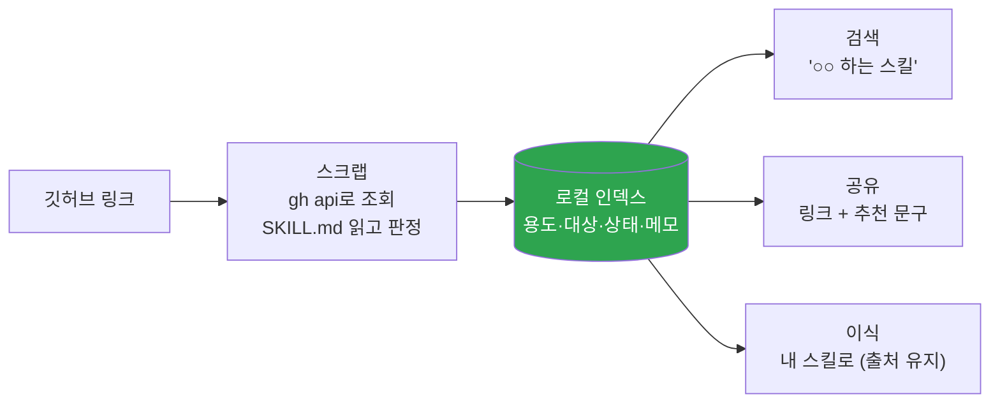

<p align="center">
  <a href="../../README.md">← 전체 스킬 모음으로</a>
</p>

<h1 align="center">skill-scrap</h1>

<p align="center">
  <strong>깃허브에서 본 스킬·에이전트·도구를 스크랩·검색·추천하는 스킬</strong><br>
  나중에 이름·용도·대상으로 찾아, 링크와 추천 문구를 바로 꺼내 줍니다.
</p>

<p align="center">
  
  
</p>

---

## 한 줄로

> **깃허브는 조회용으로만 쓰고, 결과는 로컬 인덱스에 남깁니다.**

별표(★)로는 폴더 단위가 안 잡히고, 메모도 못 달고, 무엇보다 인공지능이 못 읽습니다. 이 인덱스는 읽힙니다 — 그래서 "무슨 스킬 있었지"라고 물으면 바로 찾아 꺼냅니다.

---

## 네 가지 모드

말에서 모드를 판단합니다. 물어보지 않고 골라서 실행합니다.

| 말 | 모드 | 하는 일 |
|---|---|---|
| 링크를 던짐 / "이거 저장해" | **스크랩** | 조회 → 판정 → 인덱스에 한 줄 |
| "무슨 스킬 있었지" / "○○ 하는 스킬 찾아줘" | **검색** | 용도·대상으로 인덱스에서 찾음 |
| "링크 줘" / "공유할 거야" | **공유** | 추천 문구와 함께 꺼냄 (기본: 외부 공유용) |
| "이거 내 스킬로 만들어줘" | **이식** | 원본 출처를 유지한 채 흡수 |



---

## 판정은 세 가지만 봅니다

읽은 내용을 길게 요약하지 않고, 이것만 뽑습니다.

1. **뭘 하는 스킬인가** — 기능이 아니라 해결하는 문제로 한 줄.
2. **뭐가 쓸모 있나** — `전체이식` / `구조참고` / `조각` / `추천용` 중 하나.
3. **주의사항** — 무겁다·유료다·입문자에겐 과하다·라이선스가 걸린다. 없으면 비웁니다.

---

## 협상 불가 원칙

- **실제로 읽지 않았으면 읽은 척하지 않습니다.** 조회 실패는 실패라고 먼저 밝히고, 설명을 지어내지 않습니다.
- **URL은 폴더까지 찍습니다.** 스킬 대부분은 저장소가 아니라 저장소 안의 폴더 하나입니다.
- **남의 스킬을 내 것으로 소개하지 않습니다.** 추천·이식 모두 원저자·출처를 남깁니다.

---

## 설치

**Mac / Linux** <sub>(Apple Silicon·Intel 공통 — 파일 복사라 칩과 무관)</sub>
```bash
mkdir -p ~/.claude/skills
git clone https://github.com/imbrass9/aiden.git
cp -r aiden/skills/skill-scrap ~/.claude/skills/
```

**Windows (PowerShell)**
```powershell
New-Item -ItemType Directory -Force "$env:USERPROFILE\.claude\skills" | Out-Null
git clone https://github.com/imbrass9/aiden.git
Copy-Item -Recurse aiden\skills\skill-scrap "$env:USERPROFILE\.claude\skills\"
```

설치 후 클로드 코드를 다시 시작하면 스킬이 로드됩니다.

---

## 이렇게 부르면 됩니다

```
이 스킬 저장해줘
무슨 스킬 있었지
글쓰기 관련 스킬 찾아줘
수강생한테 추천할 거 있어?
이거 내 스킬로 이식해줘
```
