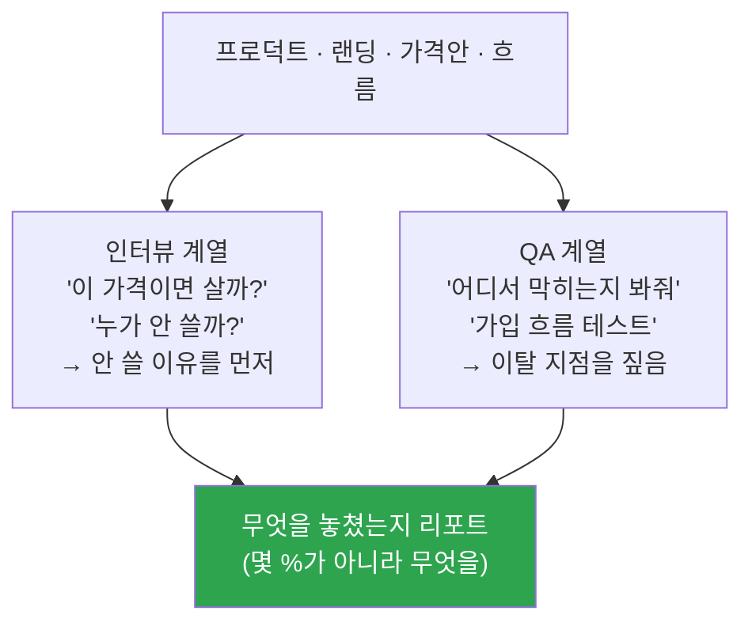

<p align="center">
  <a href="../../README.md">← 전체 스킬 모음으로</a>
</p>

<h1 align="center">virtual-customer-feedback-qa</h1>

<p align="center">
  <strong>통계에 물린 한국인 페르소나로 '가상 고객'을 불러내 피드백과 QA를 받는 스킬</strong><br>
  프로덕트를 실제 유저에게 내놓기 전에, 먼저 부딪혀 봅니다.
</p>

<p align="center">
  
  
</p>

---

## 한 줄로

> **말로 묻는 것(인터뷰)과 실제로 시켜보는 것(QA), 두 계열로 굴러갑니다.**

한국 인구통계에 정렬된 합성 페르소나에게 "이 가격이면 살까 / 누가 안 쓸까 / 어디서 막힐까"를 미리 물어봅니다. 진짜 고객을 대체하지는 않습니다 — **실제 검증의 전 단계**입니다.

---

## 두 계열



---

## 지키는 원칙

1. **가상 피드백은 실제 검증의 전 단계입니다.** 세션의 시작과 끝에 한 줄로 명시합니다.
2. **비율로 말하지 않습니다.** "40%가 이탈합니다"는 금지, "이 지점에서 막히는 사람이 있습니다"는 허용. *몇 %인가*가 아니라 *무엇을 놓쳤는가*에 답합니다.
3. **아첨 금지.** 페르소나는 친구가 아니라 바쁜 생활인입니다. 칭찬보다 **안 쓸 이유**를 먼저 말합니다.
4. **없는 정보는 지어내지 않습니다.** 카드에 없는 취향을 물으면 "글쎄요, 잘 모르겠는데요"가 정답입니다.
5. **말투를 지킵니다.** 74세 광주 어르신과 22세 서울 취준생은 같은 문장을 쓰지 않습니다. 완곡한 거절도 실제 반응입니다.
6. **한 번에 한 명씩.** 이름표를 붙여 서로의 답을 뭉개지 않습니다.

---

## 설치

**Mac / Linux**
```bash
mkdir -p ~/.claude/skills
git clone https://github.com/imbrass9/aiden.git
cp -r aiden/skills/virtual-customer-feedback-qa ~/.claude/skills/
```

**Windows (PowerShell)**
```powershell
New-Item -ItemType Directory -Force "$env:USERPROFILE\.claude\skills" | Out-Null
git clone https://github.com/imbrass9/aiden.git
Copy-Item -Recurse aiden\skills\virtual-customer-feedback-qa "$env:USERPROFILE\.claude\skills\"
```

설치 후 클로드 코드를 다시 시작하면 스킬이 로드됩니다.

---

## 이렇게 부르면 됩니다

```
가상 고객한테 피드백 받아줘
이 가격이면 살까?
누가 안 쓸까?
랜딩페이지 테스트해줘
어디서 막히는지 봐줘
가입 흐름 QA 해줘
```
